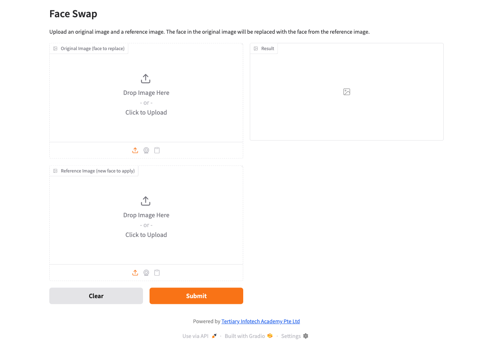

<div align="center">

# Face Swap

[](https://python.org)
[](https://gradio.app)
[](https://github.com/idootop/TinyFace)
[](https://huggingface.co/spaces/alfredang/faceswap)
[](https://opensource.org/licenses/MIT)

**A lightweight face swap web app powered by TinyFace and Gradio**

[Live Demo](https://huggingface.co/spaces/alfredang/faceswap) · [Report Bug](https://github.com/alfredang/faceswap/issues) · [Request Feature](https://github.com/alfredang/faceswap/issues)

</div>

## Screenshot



## About

Face Swap is a simple web application that lets you swap faces between two images. Upload an original image containing the face you want to replace, and a reference image with the new face to apply — the app handles the rest.

- **One-click face swap** — Upload two images and hit Submit
- **Automatic face detection** — Powered by TinyFace's ONNX-based pipeline
- **Face enhancement** — Built-in GFPGAN post-processing for natural results
- **Web UI** — Clean Gradio interface with drag-and-drop upload

## Tech Stack

| Category | Technology |
|----------|------------|
| **Frontend** | Gradio |
| **Backend** | Python |
| **AI/ML** | TinyFace, ONNX Runtime |
| **Face Detection** | SCRFD |
| **Face Recognition** | ArcFace |
| **Face Enhancement** | GFPGAN |
| **Deployment** | Hugging Face Spaces |

## Architecture

```
┌─────────────────────────────────────────┐
│              Gradio Web UI              │
│      (Image Upload + Result Display)    │
└──────────────────┬──────────────────────┘
                   │
┌──────────────────▼──────────────────────┐
│              app.py                     │
│    RGB ↔ BGR conversion + validation    │
└──────────────────┬──────────────────────┘
                   │
┌──────────────────▼──────────────────────┐
│            TinyFace Pipeline            │
│  ┌───────────┐ ┌──────────┐ ┌────────┐ │
│  │   SCRFD   │ │ ArcFace  │ │ GFPGAN │ │
│  │  Detect   │→│  Swap    │→│Enhance │ │
│  └───────────┘ └──────────┘ └────────┘ │
└─────────────────────────────────────────┘
```

## Project Structure

```
faceswap/
├── app.py              # Main application (Gradio UI + swap logic)
├── requirements.txt    # Python dependencies
├── screenshot.png      # App screenshot
└── README.md           # This file
```

## Getting Started

### Prerequisites

- Python 3.10+
- pip

### Installation

```bash
# Clone the repository
git clone https://github.com/alfredang/faceswap.git
cd faceswap

# Install dependencies
pip install -r requirements.txt
```

### Running

```bash
python app.py
```

Open [http://127.0.0.1:7860](http://127.0.0.1:7860) in your browser.

> **Note:** On first launch, TinyFace will automatically download the required models (~800MB total).

## Deployment

### Hugging Face Spaces

This app is deployed on [Hugging Face Spaces](https://huggingface.co/spaces/alfredang/faceswap). To deploy your own:

1. Create a new Space with `Gradio` SDK
2. Upload `app.py`, `requirements.txt`, and the HF `README.md` with Space metadata
3. The Space will auto-build and download models on first run

## Contributing

Contributions are welcome!

1. Fork the repository
2. Create your feature branch (`git checkout -b feature/amazing-feature`)
3. Commit your changes (`git commit -m 'Add amazing feature'`)
4. Push to the branch (`git push origin feature/amazing-feature`)
5. Open a Pull Request

Join the [Discussions](https://github.com/alfredang/faceswap/discussions) for questions and ideas.

---

<div align="center">

### Powered by [Tertiary Infotech Academy Pte Ltd](https://www.tertiarycourses.com.sg/)

### Acknowledgements

- [TinyFace](https://github.com/idootop/TinyFace) — Lightweight face swap library
- [Gradio](https://gradio.app) — Web UI framework
- [GFPGAN](https://github.com/TencentARC/GFPGAN) — Face enhancement

---

If you found this useful, please give it a ⭐

</div>
